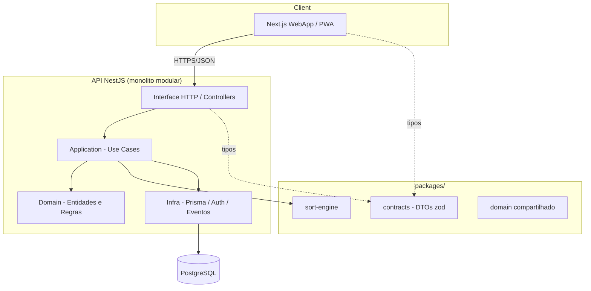
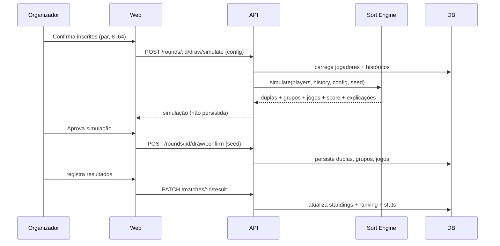

# ARCHITECTURE.md — Arquitetura do Sistema

> Fase 0. Arquitetura geral, camadas, fluxos, padrões e responsabilidades.

---

## 1. Visão geral

Monolito modular (não microsserviços) em **monorepo TypeScript**, separando claramente **frontend (Next.js)** e **backend (NestJS)**, com **domínio compartilhado** e o **Motor de Sorteio** isolado em pacote próprio.

## 2. Camadas do backend (Clean Architecture)

| Camada | Responsabilidade | Depende de |
|---|---|---|
| **Interface** (controllers, DTOs, guards) | Receber HTTP, validar entrada, auth/RBAC | Application |
| **Application** (use cases, orquestração) | Coordenar regras, transações, chamar o sort-engine | Domain |
| **Domain** (entidades, VOs, serviços de domínio) | Regras de negócio puras | — (núcleo) |
| **Infrastructure** (Prisma repos, JWT, event bus) | Persistência e integrações | Application/Domain (via interfaces) |

Regra de dependência: **de fora para dentro**. Domain não conhece Prisma nem HTTP. Repositórios são interfaces no Domain e implementados na Infra (Dependency Inversion — o "D" de SOLID).

## 3. Bounded Contexts (DDD)

- **Players** (jogadores, níveis, status)
- **Seasons & Championships** (temporadas, configs de campeonato)
- **Rounds & Registrations** (rodadas, inscrições, presença, lista de espera)
- **Draw / Sort Engine** (sorteio, simulação, score, explicação)
- **Matches & Standings** (jogos, resultados, classificação)
- **Ranking & Stats** (pontuação, ranking, estatísticas)
- **Venues & Schedule** (quadras, agenda)
- **Identity & Access** (usuários, papéis)
- **Notifications** (event-driven, futuro)

## 4. Fluxo principal (rodada → resultados → ranking)

## 5. Frontend (arquitetura)

- **Next.js App Router** com rotas por feature; **Server Components** para leitura, **Client Components** para interação.
- **TanStack Query** para cache/estado de servidor; **Zustand** para estado de UI (ex.: painel do sorteio).
- **shadcn/ui + Tailwind** como design system; **Recharts** para gráficos de evolução/ranking.
- **PWA** (instalável, offline básico de leitura).
- Camadas: `app/` (rotas) → `features/` (componentes+hooks por domínio) → `lib/api` (client tipado via `contracts`).

## 6. Padrões utilizados

- **Repository + Unit of Work** (Prisma) para persistência transacional.
- **Use Case / Command handlers** na Application.
- **Value Objects** (ex.: `Score`, `Age`, `WinRate`) para invariantes.
- **Domain Events** (ex.: `MatchResultRegistered`) — base para ranking/stats e notificações futuras.
- **Strategy** no sort-engine (regras plugáveis) e nos critérios de desempate.
- **Result/Either** para erros previsíveis (sem exceções para fluxo de negócio).

## 7. Segurança

- JWT access (curto) + refresh; Argon2 no hash de senha.
- RBAC por papel; guards por rota; ownership checks.
- Validação de entrada (zod nos contracts, class-validator na API).
- Auditoria de alterações de resultado e de configs sensíveis.

## 8. Escalabilidade e performance

- Índices em chaves de consulta quente (ver [DATABASE.md](./DATABASE.md)).
- Ranking/estatísticas materializados/atualizados por evento (evitar recomputar tudo a cada leitura).
- Sort-engine com orçamento de tempo (time-boxed) e complexidade controlada.
