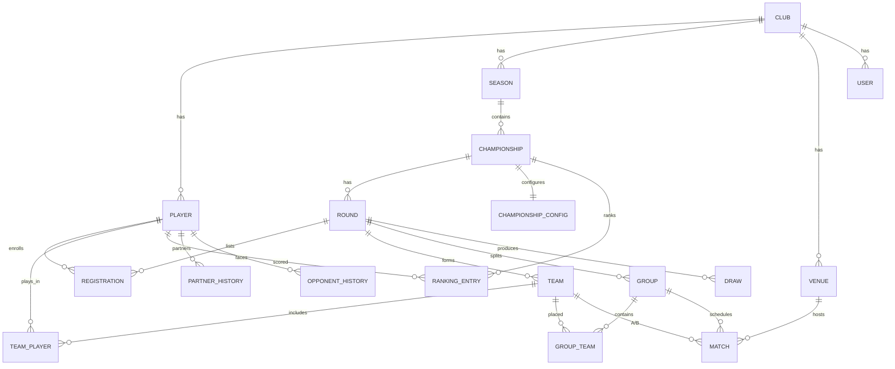

# DATABASE.md — Modelagem de Dados

> Fase 0. Modelo conceitual/lógico. Fonte da verdade será o `schema.prisma`; este doc nunca deve divergir dele.

---

## 1. Diagrama Entidade-Relacionamento (conceitual)

## 2. Entidades

### CLUB (tenant)
Raiz de tenancy. MVP: um único registro semeado.
| Campo | Tipo | Regras |
|---|---|---|
| id | UUID PK | |
| name | text | obrigatório |
| created_at | timestamptz | default now |

### USER
| Campo | Tipo | Regras |
|---|---|---|
| id | UUID PK | |
| club_id | UUID FK→CLUB | |
| email | citext unique | |
| password_hash | text | Argon2 |
| role | enum(ADMIN, ORGANIZER, PLAYER, VIEWER) | |
| player_id | UUID FK→PLAYER null | vincula login a jogador |

### PLAYER
| Campo | Tipo | Regras |
|---|---|---|
| id | UUID PK | |
| club_id | UUID FK | |
| name | text | obrigatório |
| photo_url | text null | |
| birth_date | date | idade calculada em runtime |
| phone | text null | opcional |
| skill_level | enum(BEGINNER, INTERMEDIATE, ADVANCED, PRO) | |
| status | enum(ACTIVE, INACTIVE) | soft delete |
| created_at | timestamptz | data de cadastro |

### SEASON
| id UUID PK · club_id FK · year int · name text · status enum(OPEN, CLOSED) |

### CHAMPIONSHIP
| id UUID PK · season_id FK · name text · rounds_count int · qualifiers_count int · status enum(DRAFT, ACTIVE, FINISHED) · start_date · created_at |

### CHAMPIONSHIP_CONFIG (JSONB parametrizável)
| Campo | Tipo | Descrição |
|---|---|---|
| championship_id | UUID FK (1:1) | |
| scoring_table | jsonb | pontos por colocação (ex.: `{"1":100,"2":70,...}`) |
| tiebreakers | jsonb | ordem de critérios de desempate |
| draw_weights | jsonb | pesos ranking/nível/parceiros/adversários |
| randomness | int | 0–100 |
| allow_repeat_partners | bool | |
| allow_repeat_opponents | bool | |
| final_config | jsonb | nº classificados, formato da final |

### ROUND
| id UUID PK · championship_id FK · number int · date · status enum(SCHEDULED, OPEN, DRAWN, IN_PROGRESS, FINISHED) |

### REGISTRATION
| id UUID PK · round_id FK · player_id FK · status enum(CONFIRMED, PENDING, ABSENT, WAITLIST) · created_at |
- Unique (round_id, player_id).

### DRAW
Snapshot de um sorteio confirmado (auditável).
| id UUID PK · round_id FK · seed text · config_snapshot jsonb · quality_score numeric · explanation jsonb · created_by FK→USER · created_at |

### TEAM (dupla)
| id UUID PK · round_id FK · draw_id FK · label text |

### TEAM_PLAYER
| team_id FK · player_id FK | (PK composta) — exatamente 2 por team.

### GROUP
| id UUID PK · round_id FK · name text |

### GROUP_TEAM
| group_id FK · team_id FK · seed int |

### MATCH (jogo)
| Campo | Tipo | Regras |
|---|---|---|
| id | UUID PK | |
| group_id | UUID FK | |
| team_a_id / team_b_id | UUID FK→TEAM | |
| venue_id | UUID FK→VENUE null | |
| scheduled_at | timestamptz null | |
| sets | jsonb | ex.: `[{"a":6,"b":4},{"a":6,"b":2}]` |
| winner_team_id | UUID null | calculado/validado |
| status | enum(PENDING, PLAYED, WALKOVER) | |

### STANDING (classificação do grupo — pode ser materializada)
| group_id FK · team_id FK · wins int · losses int · sets_balance int · games_balance int · position int |

### RANKING_ENTRY
| id · championship_id FK (ou season/global scope) · player_id FK · points int · position int · rounds int · wins int · losses int · win_rate numeric · scope enum(CHAMPIONSHIP, SEASON, GLOBAL) |

### PARTNER_HISTORY
| club_id · player_a_id · player_b_id · times_together int · last_round_id | (par não ordenado, normalizado a<b).

### OPPONENT_HISTORY
| club_id · player_a_id · player_b_id · times_faced int · last_round_id |

### VENUE (quadra)
| id · club_id · name · number · location · availability jsonb |

### CALENDAR_EVENT (agenda)
| id · club_id · type enum(ROUND, FINAL, EVENT, TRAINING) · title · date · ref_id null |

### AUDIT_LOG
| id · user_id · entity · entity_id · action · before jsonb · after jsonb · created_at |

## 3. Índices recomendados
- `player(club_id, status)`, `player(name)` (busca).
- `registration(round_id, status)`.
- `match(group_id, status)`.
- `ranking_entry(scope, championship_id, points DESC)`.
- `partner_history(club_id, player_a_id, player_b_id)` unique.
- `opponent_history(club_id, player_a_id, player_b_id)` unique.

## 3a. Implementado

- **Sprint 1:** `Club`, `User` (enum `Role`).
- **Sprint 2:** `Player` (enums `SkillLevel` = BEGINNER/INTERMEDIATE/ADVANCED/PRO e `PlayerStatus` = ACTIVE/INACTIVE). Colunas: `club_id`, `name`, `photo_url` (nullable), `birth_date` (date; idade derivada — BR-01), `phone` (nullable), `skill_level`, `status`, `created_at`, `updated_at`. Índices: `(club_id, status)` e `(club_id, name)`. Sem exclusão física (soft delete via `status=INACTIVE` — BR-02).
- **Sprint 3:** `Season` (enum `SeasonStatus` = OPEN/CLOSED; `year` único por clube) e `Championship` (enum `ChampionshipStatus` = DRAFT/ACTIVE/FINISHED; `rounds_count`, `qualifiers_count`, `start_date`). `ChampionshipConfig` (1:1) com JSONB: `scoring_table`, `tiebreakers`, `draw_weights`, `final_config` + `randomness` (int), `allow_repeat_partners`, `allow_repeat_opponents`. Lock estrutural (scoring/tiebreakers/final/rounds/qualifiers) fora de DRAFT — BR-05.

## 3b. Ajustes de modelagem (regras resolvidas 2026-07-02)

- **CHAMPIONSHIP.status** e lock de config: ao virar `ACTIVE`, campos estruturais (`scoring_table`, `tiebreakers`, `rounds_count`, `qualifiers_count`, `final_config`) tornam-se imutáveis (BR-05). `draw_weights`/`randomness` podem ser sobrescritos por rodada (ver `DRAW.config_snapshot`).
- **ROUND.match_format** (jsonb): formato de partida da rodada — `{"sets":1,"gamesPerSet":6,"tieBreakAt":6,"matchTieBreak":false}` (default 1 set — BR-26).
- **ROUND.kind** enum(`REGULAR`, `FINAL_PHASE`): distingue rodadas regulares da fase final; na `FINAL_PHASE` o sorteio ignora histórico de parceiros (BR-34).
- **ROUND.group_size_pref** int default 3 (BR-23 / FORMATS.md).
- **MATCH.is_walkover** bool + **MATCH.walkover_injury** bool: W.O.; se `walkover_injury=true`, os games não penalizam o aproveitamento do jogador lesionado (BR-27). Placar padrão do W.O. = **6/0** (em `ROUND.match_format`).
- **REGISTRATION.substituted_by** UUID FK→PLAYER null: registra substituição (lesão/desistência) — promoção manual da lista de espera (BR-10).
- **ROUND_RESULT** (nova, por dupla): `round_id`, `team_id`, `final_position` int, `points_awarded` int — colocação final na rodada (grupos+mata-mata) e pontos atribuídos (BR-30). Alimenta `RANKING_ENTRY`.

## 4. Regras de integridade
- TEAM sempre com exatamente 2 jogadores.
- REGISTRATION única por (round, player).
- Histórico (partner/opponent) atualizado transacionalmente ao confirmar sorteio e ao registrar resultado.
- Nenhuma exclusão física de jogadores/histórico (soft delete + auditoria).
