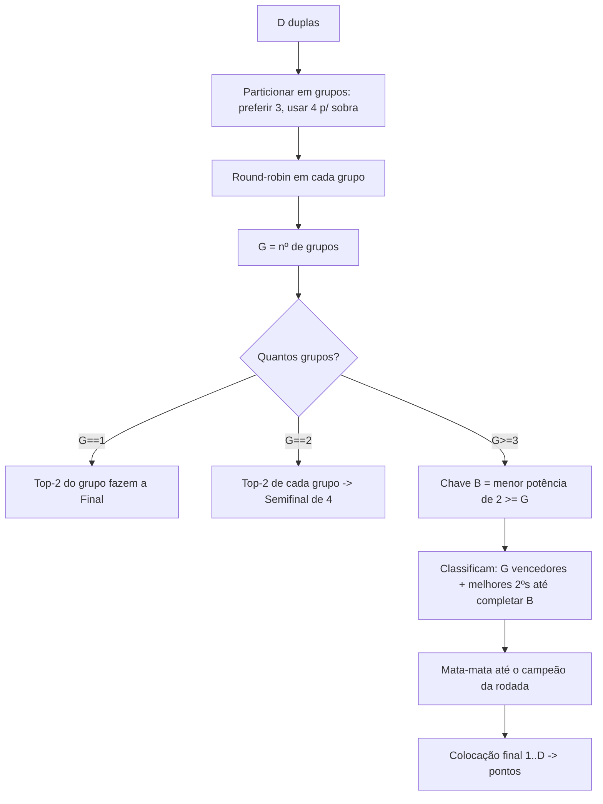

# FORMATS.md — Matriz de Formatos de Rodada

> Mapeia e valida **todos os formatos possíveis** de uma rodada em função do nº de inscritos.
> Regras aprovadas pelo PO (2026-07-02): tamanho de grupo preferencial **3** (4 para sobras); classificação **vencedores + melhores 2ºs** até fechar chave de potência de 2.

---

## 1. Conceitos

- **Inscritos** sempre **par**, entre **8 e 64** ⇒ **Duplas (D) = inscritos / 2 ⇒ 4 a 32**.
- **Grupo:** round-robin (todos contra todos).
- **Chave (mata-mata):** potência de 2 (2, 4, 8, 16). Nomes: 2=Final, 4=Semifinal, 8=Quartas, 16=Oitavas.
- **Pontuação:** atribuída pela **colocação final da dupla na rodada** via `scoring_table` (BR-30).

## 2. Algoritmo de formação (determinístico)

**Particionamento (preferir grupos de 3):**
- `D mod 3 == 0` → todos os grupos de 3.
- `D mod 3 == 1` → um grupo de 4 + resto de 3 (ex.: 7 = 4+3).
- `D mod 3 == 2` → dois grupos de 4 + resto de 3 (ex.: 8 = 4+4; 11 = 3+4+4).
- `D == 5` → um único grupo de 5 (caso especial).

**Seleção de 2ºs (quando faltam vagas para fechar B):** ranqueiam-se todos os 2º colocados por (pontos → saldo de games → confronto direto) e sobem os melhores.

## 3. Matriz validada (D = 4 a 32)

| Inscritos | Duplas | Grupos (tamanho) | G | Chave | Classificados p/ chave | Fase inicial |
|---:|---:|---|---:|---:|---|---|
| 8  | 4  | 4                 | 1 | 2  | top-2 do grupo | **Final** |
| 10 | 5  | 5                 | 1 | 2  | top-2 do grupo | **Final** |
| 12 | 6  | 3,3               | 2 | 4  | top-2 de cada grupo | **Semifinal** |
| 14 | 7  | 4,3               | 2 | 4  | top-2 de cada grupo | **Semifinal** |
| 16 | 8  | 4,4               | 2 | 4  | top-2 de cada grupo | **Semifinal** |
| 18 | 9  | 3,3,3             | 3 | 4  | 3 vencedores + 1 melhor 2º | **Semifinal** ✅ (caso real) |
| 20 | 10 | 3,3,4             | 3 | 4  | 3 venc. + 1 melhor 2º | Semifinal |
| 22 | 11 | 3,4,4             | 3 | 4  | 3 venc. + 1 melhor 2º | Semifinal |
| 24 | 12 | 3,3,3,3           | 4 | 4  | 4 vencedores | Semifinal |
| 26 | 13 | 3,3,3,4           | 4 | 4  | 4 vencedores | Semifinal |
| 28 | 14 | 3,3,4,4           | 4 | 4  | 4 vencedores | Semifinal |
| 30 | 15 | 3,3,3,3,3         | 5 | 8  | 5 venc. + 3 melhores 2ºs | Quartas |
| 32 | 16 | 3,3,3,3,4         | 5 | 8  | 5 venc. + 3 melhores 2ºs | Quartas |
| 34 | 17 | 3,3,3,4,4         | 5 | 8  | 5 venc. + 3 melhores 2ºs | Quartas |
| 36 | 18 | 3×6               | 6 | 8  | 6 venc. + 2 melhores 2ºs | Quartas |
| 38 | 19 | 3×5,4             | 6 | 8  | 6 venc. + 2 melhores 2ºs | Quartas |
| 40 | 20 | 3×4,4,4           | 6 | 8  | 6 venc. + 2 melhores 2ºs | Quartas |
| 42 | 21 | 3×7               | 7 | 8  | 7 venc. + 1 melhor 2º | Quartas |
| 44 | 22 | 3×6,4             | 7 | 8  | 7 venc. + 1 melhor 2º | Quartas |
| 46 | 23 | 3×5,4,4           | 7 | 8  | 7 venc. + 1 melhor 2º | Quartas |
| 48 | 24 | 3×8               | 8 | 8  | 8 vencedores | Quartas |
| 50 | 25 | 3×7,4             | 8 | 8  | 8 vencedores | Quartas |
| 52 | 26 | 3×6,4,4           | 8 | 8  | 8 vencedores | Quartas |
| 54 | 27 | 3×9               | 9 | 16 | 9 venc. + 7 melhores 2ºs | Oitavas |
| 56 | 28 | 3×8,4             | 9 | 16 | 9 venc. + 7 melhores 2ºs | Oitavas |
| 58 | 29 | 3×7,4,4           | 9 | 16 | 9 venc. + 7 melhores 2ºs | Oitavas |
| 60 | 30 | 3×10              | 10| 16 | 10 venc. + 6 melhores 2ºs | Oitavas |
| 62 | 31 | 3×9,4             | 10| 16 | 10 venc. + 6 melhores 2ºs | Oitavas |
| 64 | 32 | 3×8,4,4           | 10| 16 | 10 venc. + 6 melhores 2ºs | Oitavas |

✅ = formato idêntico ao usado na prática pelo clube.

## 4. Regras de borda (aprovadas pelo PO)

1. **G=1 (8 e 10 jogadores):** os **2 primeiros do grupo fazem a Final**.
2. **G=2 (12, 14, 16 jogadores):** classificam-se os **2 primeiros de cada grupo** para uma **Semifinal de 4** (cruzamento 1ºA×2ºB e 1ºB×2ºA), seguida de Final.
3. **G≥3:** vencedores de grupo + melhores 2ºs até fechar a chave de potência de 2 (regra geral).
4. **Placar padrão de W.O. por lesão:** **6/0** (BR-27).

**Observação:** grupos de 3 geram 2 jogos por dupla. Se quiser mais jogos, basta configurar a preferência de grupo = 4 na rodada.
**Ponto ainda aberto:** campos muito grandes (G=9/10 → chave de 16) classificam muitos 2ºs — reavaliar na prática quando houver rodadas desse porte.

## 5. Configuração por rodada

O organizador pode sobrescrever, na criação da rodada:
- Preferência de tamanho de grupo (3 ou 4).
- Formato de partida (1 ou 3 sets, games por set, tie-break).
- Forçar/omitir final em grupo único.

Se nada for alterado, o sistema aplica os defaults desta matriz. A **simulação do sorteio** já exibe o formato resultante para conferência antes de confirmar.
