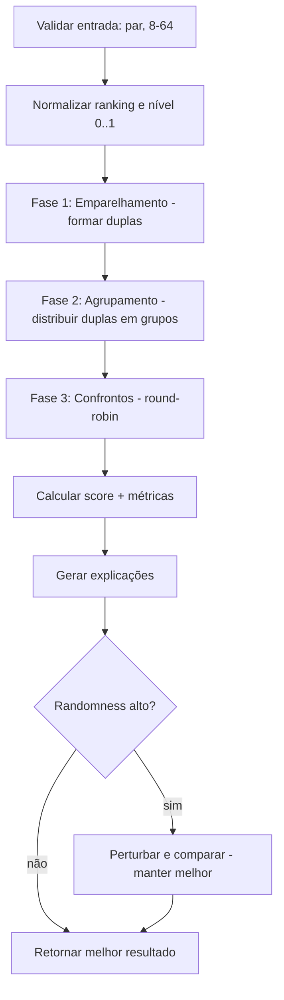

# SORT_ENGINE.md — Motor Inteligente de Sorteio

> Documento crítico. Sempre atualizado quando o algoritmo mudar.
> Pacote: `packages/sort-engine` (TypeScript puro, sem I/O, determinístico via seed).

---

## 1. Objetivo
Gerar a **melhor combinação possível** de duplas e grupos para uma rodada, obedecendo regras configuráveis, em vez de simplesmente embaralhar jogadores. Deve ser explicável, pontuável (score) e reprodutível.

## 2. Entradas e saídas

**Input**
```ts
interface DrawInput {
  players: PlayerInput[];        // id, ranking, skillLevel
  partnerHistory: Map<PairKey, number>;   // vezes que jogaram juntos
  opponentHistory: Map<PairKey, number>;  // vezes que se enfrentaram
  config: DrawConfig;
  seed: string;                  // reprodutibilidade
}
interface DrawConfig {
  weights: { ranking: number; skill: number; partner: number; opponent: number };
  randomness: number;            // 0..100
  allowRepeatPartners: boolean;
  allowRepeatOpponents: boolean;
  groupSizePreference: number;   // ex.: 3 ou 4 (BR-23 [VALIDAR])
}
```

**Output**
```ts
interface DrawResult {
  teams: Team[];                 // pares de players
  groups: Group[];               // teams distribuídos
  matches: Match[];              // round-robin por grupo
  qualityScore: number;          // 0..100
  metrics: DrawMetrics;          // detalhamento
  explanations: string[];        // decisões em linguagem natural
  seed: string;
}
```

## 3. Fluxo do algoritmo


## 4. Fase 1 — Emparelhamento (formação das duplas)
Modelado como **matching em grafo** onde o custo de parear i e j penaliza más combinações.

**Custo de um par (i, j)** — quanto menor, melhor:
```
cost(i,j) = w_partner * partnerRepeatPenalty(i,j)
          + w_ranking * rankingImbalance(i,j)
          + w_skill   * skillImbalance(i,j)
          - w_ranking * complementarity(i,j)   // premia forte+fraco
```
- `partnerRepeatPenalty` cresce com `partnerHistory[(i,j)]` (BR-13). Se `allowRepeatPartners=false`, pares já vistos recebem custo proibitivo, com fallback à menor repetição se inviável (BR-18).
- `complementarity`: premia dupla com um ranking alto + um baixo (BR-15), evitando dois fortes juntos.
- `skillImbalance`: complementa via nível técnico (BR-16).

**Estratégia:** minimizar custo total do emparelhamento.
- MVP: heurística **greedy** (ordena candidatos por custo, fixa melhores pares) + **local search** (2-opt: troca jogadores entre duplas se reduzir custo global).
- Evolução: **blossom / min-cost matching** para ótimo exato quando N permitir.

## 5. Fase 2 — Agrupamento
Distribui duplas em grupos de tamanho `groupSizePreference`, **balanceando a força dos grupos** (soma de ranking das duplas próxima entre grupos) e **espalhando duplas fortes** (serpentina/"snake seeding").
- Penaliza colocar no mesmo grupo adversários já muito repetidos (BR-14, via `opponentHistory`), respeitando `allowRepeatOpponents`.

## 6. Fase 3 — Confrontos
Round-robin dentro de cada grupo (todos contra todos, BR-22). Ordem dos jogos otimizada para distribuir descanso/uso de quadras (refino futuro).

## 7. Grau de aleatoriedade (randomness 0–100)
Controla o trade-off exploração × otimização:
- **0%** — ignora pesos: emparelhamento aleatório (seed).
- **1–99%** — mistura: probabilidade de aceitar solução sub-ótima proporcional a `randomness` (estilo *simulated annealing*: temperatura ∝ randomness).
- **100%** — puramente otimizado pelos pesos (sem ruído).

Implementação: `randomness` define quantas iterações de perturbação são feitas e a probabilidade de aceitar pioras; **sempre retorna o melhor resultado avaliado**, garantindo qualidade mesmo com ruído.

## 8. Score de qualidade (0–100)
Combinação ponderada e normalizada das métricas (quanto melhor, maior):
```
score = 100 - normalized(
    a*repeatedPartners + b*repeatedOpponents
  + c*groupImbalance   + d*avgRankingGapInsideTeams
  - e*partnerDiversity )
```
**DrawMetrics reportadas (BR-21):**
- `repeatedPartners` — nº de duplas que já haviam jogado juntas.
- `repeatedOpponents` — nº de confrontos repetidos gerados.
- `groupBalance` — desvio-padrão da força entre grupos.
- `avgRankingDiff` — diferença média de ranking dentro das duplas.
- `partnerDiversity` — % de duplas inéditas.

## 9. Explicabilidade (BR-19/21)
Para cada decisão relevante, gerar frase legível. Exemplos:
- "João não foi parceiro de Carlos porque já jogaram juntos 4 vezes."
- "Pedro foi pareado com Lucas para equilibrar o ranking (300 + 120)."
- "Grupo B recebeu uma dupla forte para equilibrar a força entre os grupos."

As explicações são derivadas dos termos de custo que mais pesaram em cada escolha (rastreio das decisões), não texto genérico.

## 10. Determinismo e testes
- Todo aleatório passa por um **PRNG semeável** (ex.: mulberry32) — mesma seed ⇒ mesmo resultado.
- Testes com cenários sintéticos: 8/16/32/64 jogadores; históricos densos; pesos extremos; randomness 0/50/100.
- Propriedade: nunca gerar dupla inválida, todo jogador em exatamente uma dupla, todo grupo round-robin completo.

> **Implementado (Fase 10):** o modo fase final é acionado quando a rodada é `kind=FINAL_PHASE` — `DrawService` força `allowRepeatPartners=true` e peso de parceiro 0, passa históricos vazios e não grava/reverte `PartnerHistory`/`OpponentHistory`. A qualificação usa o ranking do campeonato (`qualifiers_count` melhores jogadores).

## 10b. Fase final do campeonato (modo especial)
A fase final usa o **mesmo motor**, mas com config específica (BR-34):
- Entrada: as `qualifiers_count` melhores duplas/jogadores por **pontuação acumulada** nas rodadas.
- **Histórico de parceiros é ignorado** (`allowRepeatPartners = true`, peso de parceiro = 0) — pode repetir dupla que já jogou junto.
- Ainda balanceia ranking/nível e distribui a força entre os grupos.
- Produz **fase de grupos + mata-mata** conforme `final_config` (ver [FORMATS.md](./FORMATS.md) para a lógica de chave).

## 10c. Formação de grupos dinâmica
O agrupamento (Fase 2) respeita a **matriz de formatos** de [FORMATS.md](./FORMATS.md): tamanho preferencial 3 (4 para sobras), nº de grupos e chave de mata-mata derivados do nº de duplas. A classificação intra-rodada (vencedores + melhores 2ºs até fechar potência de 2) é aplicada após os jogos, não pelo motor de sorteio.

## 10d. Implementado (Sprint 5 — fatia motor + simular)
Pacote `packages/sort-engine` (TS puro, determinístico) entregue para QA:
- **PRNG:** `mulberry32` + `hashSeed` (FNV-1a) → mesma seed reproduz o resultado (`prng.ts`).
- **Fase 1 (`pairing.ts`):** custo `w.partner·penalidade − w.ranking·complementaridade − w.skill·complementoNível`; **greedy** por menor custo + **2-opt**. `allowRepeatPartners=false` ⇒ custo proibitivo (1000) com **fallback** à menor repetição (BR-18).
- **Fase 2 (`grouping.ts`):** tamanhos via `partitionGroups` (FORMATS.md); distribuição greedy pelo grupo mais leve (equilíbrio de força); quando `allowRepeatOpponents=false`, passes de troca que reduzem confrontos repetidos.
- **Fase 3 (`round-robin.ts`):** todos contra todos por grupo (BR-22).
- **Score/métricas (`metrics.ts`):** `repeatedPartners`, `repeatedOpponents`, `groupBalance`, `avgRankingDiff`, `partnerDiversity`; `qualityScore` 0–100 (BR-21).
- **Explicações (`explain.ts`):** frases derivadas dos termos dominantes (BR-19/21).
- **Orquestrador (`draw.ts`):** `runDraw(input)`; `randomness` 0 = aleatório pela seed, 100 = melhor de N reinícios com ruído (sempre retorna o melhor avaliado — §7). Valida par/[8,64] (`DrawError`).
- **API:** `POST /rounds/:id/draw/simulate` (não persiste — BR-19); **enforcement** `409 ODD_PLAYER_COUNT` / `422 PLAYER_COUNT_OUT_OF_RANGE`. **Web:** tela de simulação com score, métricas, duplas, grupos/jogos e explicações; botão "Regenerar".
- **Nota (proxy de ranking):** `RANKING_ENTRY` só existe na Sprint 7; até lá a força vem do `skillLevel` (`SKILL_STRENGTH`: BEGINNER 25 · INTERMEDIATE 50 · ADVANCED 75 · PRO 100). Trocar por ranking real quando existir.
- **Confirmar sorteio (Sprint 5 — fatia 2, implementado):** `POST /rounds/:id/draw/confirm` re-executa `runDraw` com a mesma seed+config exibida e **persiste** Draw/Team/TeamPlayer/Group/GroupTeam/Match numa transação, seta a rodada como `DRAWN` e **incrementa** `PartnerHistory`/`OpponentHistory` (BR-20). `GET /rounds/:id/draw` retorna o sorteio gravado; `DELETE` (descartar) apaga o sorteio, **reverte** o histórico e reabre a rodada. Nova confirmação é bloqueada (409 `DRAW_EXISTS`) até descartar. O `simulate` **agora carrega o histórico real** do banco — o motor efetivamente evita repetir parceiros/adversários ao longo da temporada (BR-13/14). Lógica de deltas em `apps/api/src/rounds/history.service.ts` (com testes puros).

## 11. Regras futuras (extensível)
O motor recebe regras como **estratégias plugáveis** (padrão Strategy). Roadmap de novas regras:
- Restrições de disponibilidade de jogador por horário/quadra.
- "Não parear" / "não enfrentar" manuais (lista negra).
- Balanceamento por idade/categoria.
- Objetivo de temporada (rotação máxima de parceiros ao longo das rodadas).
