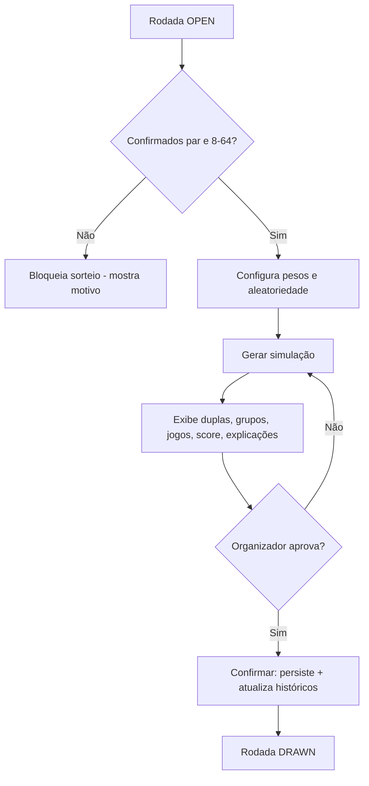
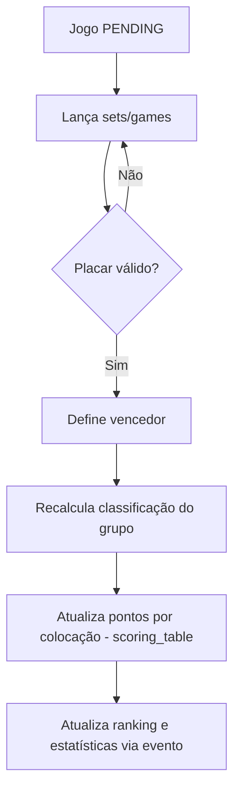
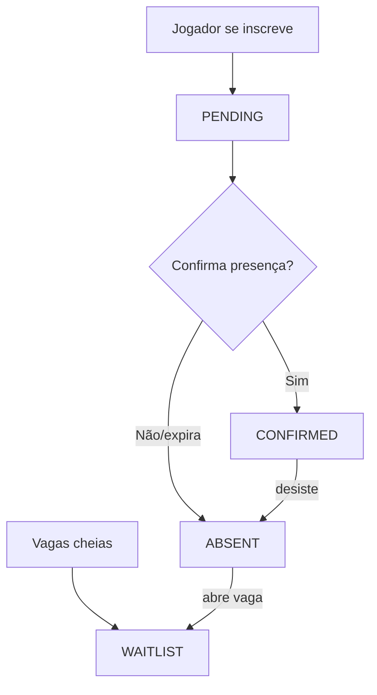
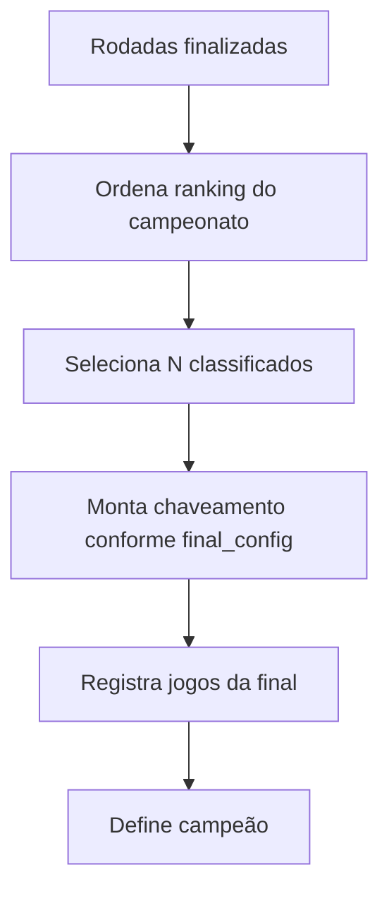

# USE_CASES.md — Casos de Uso e Fluxos

> Fase 0. Atores e casos de uso principais, com fluxos.

---

## 1. Atores
- **Organizador/Admin** — configura e opera o campeonato.
- **Jogador** — consulta seus dados, se inscreve, confirma presença.
- **Visitante** — consulta ranking/resultados públicos.
- **Sistema** — cálculos automáticos (idade, classificação, ranking, stats).

## 2. Casos de uso principais

| ID | Caso de uso | Ator | Resumo |
|---|---|---|---|
| UC-01 | Cadastrar jogador | Organizador | Cria/edita jogador com dados e nível |
| UC-02 | Criar temporada/campeonato | Organizador | Define rodadas, classificados e regras |
| UC-03 | Abrir rodada e gerir inscrições | Organizador | Confirma presença, lista de espera |
| UC-04 | Simular sorteio | Organizador | Gera duplas/grupos/jogos + score + explicação, sem salvar |
| UC-05 | Confirmar sorteio | Organizador | Persiste o resultado da simulação aprovada |
| UC-06 | Registrar resultado | Organizador | Lança sets/games; sistema atualiza classificação |
| UC-07 | Consultar ranking/estatísticas | Todos | Visualiza rankings e stats |
| UC-08 | Gerar fase final | Organizador | Classifica N e monta chaveamento |
| UC-09 | Gerir quadras e agenda | Organizador | Cadastra quadras, calendário |

## 3. Fluxo — UC-04/05 Sorteio (feliz)

## 4. Fluxo — UC-06 Resultado → Ranking

## 5. Fluxo — UC-03 Inscrição/Presença

## 6. Fluxo — UC-08 Fase Final

